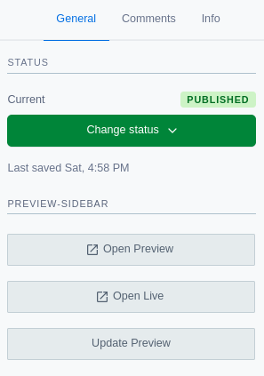

This project is an [UI Extension](https://www.contentful.com/developers/docs/extensibility/ui-extensions/) that adds a custom preview-sidebar to Contentful.



- [Getting started](#getting-started)
- [Contentful documentation](#contentful-documentation)

## Getting started

First you need to clone this repository from Github:

```bash
# Clone the repository
$ git clone git@github.com:hausgold/contentful-preview-sidebar.git
# Go in the repository directory
$ cd contentful-preview-sidebar
```

Next install packages and Contentful's Command-line interface ([CLI](https://www.contentful.com/developers/docs/tools/cli/)):

```bash
# Install packages
$ npm install -g contentful-cli
```

We assume you have access to Contentful. The only thing
which is left, is to login:

```bash
# Login to Contentful
$ npm run login
```

Follow the instructions in the console, open the browser and copy the created token. Then just add the space-id and start the project and the desired space:

```bash
# Add space-id and choose a space
$ contentful use space 5qea3umoe8gl
# Start project
$ npm run start

**Note:** The preview sidebar is not accessible when you are working on the `hausgold.de` production/master space. Remember to inform marketing beforehand so that they are aware of it or use a separate environment in contentful to run development against.

### Contentful documentation

Unfortunately, not everything is well documented, scince ui extensions are deprecated in favour of apps on Contentful, but here are links that may help:

- [Contentful content APIs](https://www.contentful.com/developers/docs/concepts/apis/)
- [Content Delivery API](https://www.contentful.com/developers/docs/references/content-delivery-api/)
- [App SDK Reference](https://www.contentful.com/developers/docs/extensibility/app-framework/sdk/)
